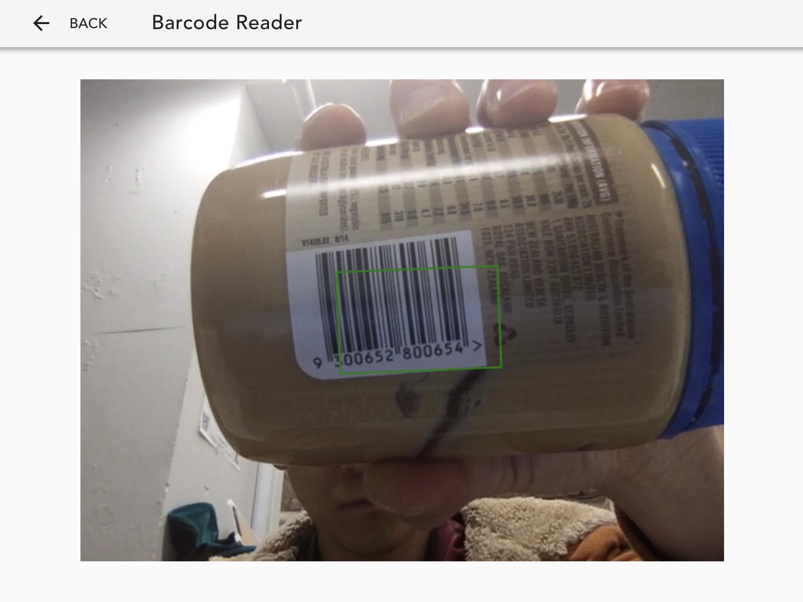
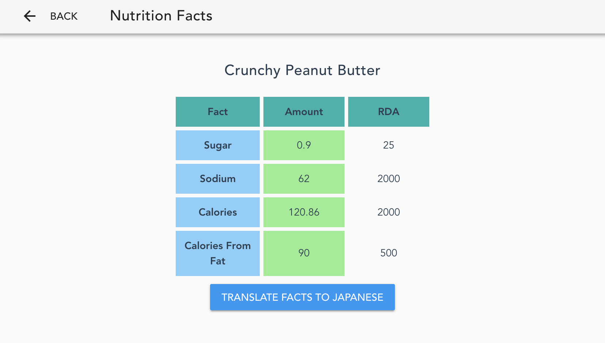
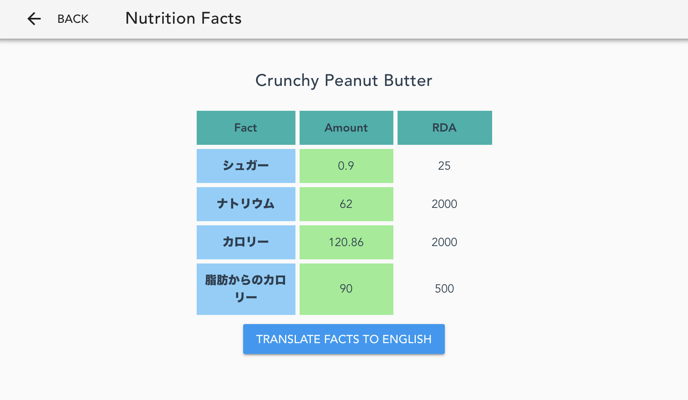
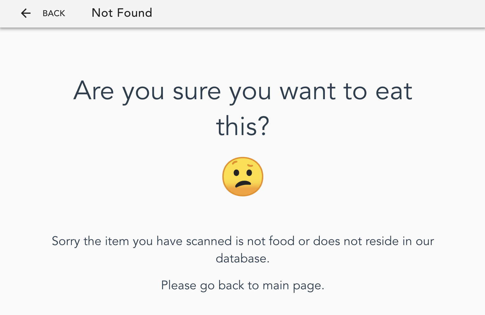

# Body Diet Metrix


Body Diet Metrix to help Japanese tourists who eat American food.

## Features

- Scan EAN barcodes.
- Retrieve nutrition facts according to the barcode.
- Translate nutrition facts to Japanese.

## Usage For Development

```
yarn
```

### Compiles and hot-reloads for development

```
yarn dev
```

## Production Build

### Compiles and minifies for production

```
yarn build
```

And

```
yarn start
```

if you want to deploy this app follow orders as below.

1. Fork this repository to your GitHub account.
2. Create a new app in Heroku. (If you don't have an account, just create it.)
3. Connect to your repository forked from **Deploy** tab of your Heroku app.


4. Click `Deploy Branch`.


## Demo

[Live Demo](https://body-diet-metrix.herokuapp.com/)

### Start

Click `START`.


### Scan a barcode

It supports **EAN** barcode only as of now but you can change a setting.



### Show result

Once barcode is detected, it will show English nutrition facts.



Click `TRANSLATE TO JAPANESE` then you can see nutrition facts in Japanese.



But if there is no data then it show up a messages as below.



## Useful Resources

- [Rakuten Rapid API](https://english.api.rakuten.net/)
- [QuaggaJS](https://serratus.github.io/quaggaJS/)
- [Vuex](https://vuex.vuejs.org/)
- [Vue.js](https://vuejs.org/)
- [Vuetify](https://vuetifyjs.com/en/)
- [Getting Started on Heroku with Node.js](https://devcenter.heroku.com/articles/getting-started-with-nodejs)
